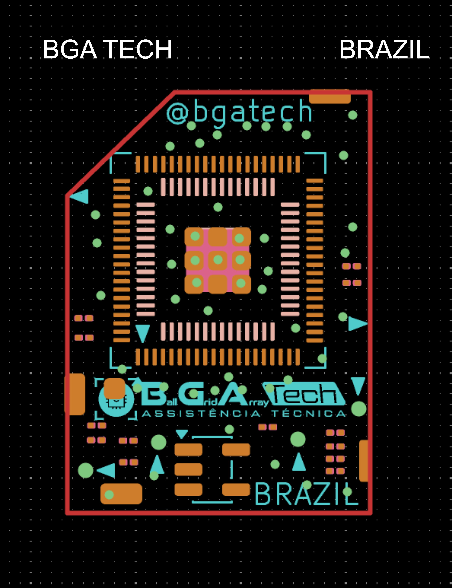

#  MOD BR — REALTEK PARA PANASONIC | PlayStation 5

## BGA TECH BRAZIL

  

---

## ✅ PROJETO CONCLUÍDO E PRONTO PARA PRODUÇÃO

O **MOD BR — REALTEK PARA PANASONIC** está **concluído e pronto para produção**.

Os arquivos de fabricação da PCB estão disponíveis em **formato GERBER**, permitindo que o projeto seja enviado diretamente para fabricação profissional de placas de circuito impresso.

---

## 📌 SOBRE O PROJETO

Este projeto apresenta o **MOD BR — REALTEK PARA PANASONIC**, desenvolvido como uma alternativa técnica para reparos em **PlayStation 5**.

O projeto foi desenvolvido pela **BGA TECH BRAZIL** e representa uma contribuição para a comunidade técnica, reparadores de consoles e gamers de todo o mundo.

A proposta é disponibilizar uma solução que possa ser estudada, reproduzida e utilizada por profissionais de reparo em diferentes países.

---

## 🎯 OBJETIVO

O principal objetivo deste projeto é criar uma alternativa técnica para recuperação de consoles **PlayStation 5** que apresentem falhas relacionadas ao circuito abordado neste MOD.

O projeto poderá ser reproduzido por técnicos em todo o mundo, ajudando a recuperar consoles que poderiam ser descartados por falta de componentes, dificuldade de reposição ou ausência de uma alternativa de reparo.

> **Conhecimento compartilhado pode ajudar a salvar milhares de consoles PlayStation 5 ao redor do mundo.**

---

## 🌎 UM PROJETO BRASILEIRO PARA O MUNDO

Este projeto foi desenvolvido no **Brasil 🇧🇷**.

O **MOD BR — REALTEK PARA PANASONIC** é a minha contribuição para o mundo dos gamers e para a comunidade técnica.

O objetivo é permitir que outros técnicos possam reproduzir esta solução e utilizá-la em reparos de PlayStation 5 em diferentes partes do mundo.

A iniciativa busca contribuir para:

* Recuperação de consoles;
* Redução de descarte eletrônico;
* Compartilhamento de conhecimento;
* Desenvolvimento técnico;
* Pesquisa;
* Criação de novas soluções;
* Evolução do reparo de consoles.

---

## 🔧 DESENVOLVIMENTO DO PROJETO

O desenvolvimento do projeto envolveu diversas etapas de análise, desenvolvimento e validação.

Entre elas:

* Estudo do circuito;
* Análise de sinais;
* Mapeamento de conexões;
* Levantamento de pinagens;
* Desenvolvimento do circuito;
* Criação da PCB;
* Desenvolvimento do layout;
* Posicionamento dos componentes;
* Revisão das trilhas;
* Testes;
* Validação;
* Correções;
* Geração dos arquivos GERBER;
* Preparação final para fabricação.

---

## 🏭 PCB PRONTA PARA PRODUÇÃO

A placa desenvolvida para o **MOD BR — REALTEK PARA PANASONIC** está pronta para fabricação.

Os arquivos de produção foram gerados em **formato GERBER** e podem ser utilizados por empresas especializadas em fabricação de placas de circuito impresso.

Dependendo do pacote disponibilizado, poderão estar presentes:

* Camada de cobre superior;
* Camada de cobre inferior;
* Máscara de solda superior;
* Máscara de solda inferior;
* Serigrafia superior;
* Serigrafia inferior;
* Contorno da placa;
* Arquivos de furação;
* Arquivos auxiliares de fabricação.

> **O projeto encontra-se pronto para produção da PCB através dos arquivos GERBER disponibilizados neste repositório.**

---

## 📂 ARQUIVOS DO PROJETO

Este repositório poderá conter:

* Arquivos GERBER;
* Arquivos da PCB;
* Fotos do projeto;
* Arquivos de fabricação;
* Documentação;
* Testes;
* Informações técnicas;
* Atualizações do projeto.

---

## 📸 IMAGENS DO PROJETO

As imagens do desenvolvimento, PCB, montagem e instalação do projeto poderão ser disponibilizadas neste repositório.

  

---

## ⚠️ IMPORTANTE

Este projeto é destinado principalmente a:

* Técnicos em eletrônica;
* Técnicos especializados em consoles;
* Profissionais de microssoldagem;
* Reparadores de placas eletrônicas;
* Profissionais com conhecimento em diagnóstico eletrônico.

A instalação e utilização deste MOD exigem conhecimentos técnicos.

É recomendável possuir experiência com:

* Eletrônica;
* Multímetro;
* Osciloscópio;
* Microssoldagem;
* Componentes SMD;
* Retrabalho eletrônico;
* Leitura de esquemas;
* Análise de sinais;
* Diagnóstico de placas.

---

## ⚠️ AVISO DE RESPONSABILIDADE

Antes de realizar qualquer modificação, verifique cuidadosamente:

* Tensões;
* Pinagens;
* Alimentações;
* Orientação dos componentes;
* Continuidade;
* Possíveis curtos-circuitos;
* Pontos de conexão;
* Soldagem;
* Integridade das trilhas.

Uma conexão incorreta poderá causar danos permanentes ao console ou aos componentes utilizados.

A reprodução deste projeto deve ser realizada por profissionais com conhecimento técnico adequado.

---

## 🧪 TESTES E VALIDAÇÃO

O projeto passou por etapas de desenvolvimento, testes e validação antes da geração dos arquivos finais destinados à produção.

Mesmo com o projeto concluído, novas informações poderão ser adicionadas caso sejam identificadas:

* Melhorias;
* Novos testes;
* Novas revisões;
* Correções;
* Novas compatibilidades;
* Novas versões do PlayStation 5;
* Novos métodos de instalação.

---

## 🔄 ATUALIZAÇÕES

Sempre consulte a versão mais recente deste repositório antes de fabricar ou instalar a PCB.

Caso existam diferentes revisões dos arquivos GERBER, utilize sempre a versão indicada como mais recente e validada.

---

## 🤝 CONTRIBUIÇÕES

Contribuições técnicas são bem-vindas.

Caso você reproduza este projeto e encontre:

* Uma melhoria;
* Uma correção;
* Uma incompatibilidade;
* Uma nova compatibilidade;
* Uma nova forma de instalação;
* Um resultado diferente;
* Uma melhoria na PCB;
* Uma melhoria no layout;

essas informações poderão contribuir para futuras revisões do projeto.

O compartilhamento de conhecimento fortalece toda a comunidade técnica.

---

❤️ APOIE O PROJETO

Se este projeto foi útil para você e deseja contribuir para que novos projetos, pesquisas, testes e desenvolvimentos continuem sendo realizados, você também pode apoiar a BGA TECH BRAZIL através de uma contribuição voluntária.

💳 PayPal

alextecsony@hotmail.com

🇧🇷 PIX

11 9 3283-9998

Toda contribuição ajuda a continuar investindo em pesquisa, desenvolvimento, testes, fabricação de protótipos e compartilhamento de novos projetos com a comunidade técnica.

---

## 🔬 PESQUISA E DESENVOLVIMENTO

Este projeto nasceu através de pesquisa, análise eletrônica, desenvolvimento e testes.

O objetivo não é apenas apresentar uma placa, mas também contribuir para o desenvolvimento de novas soluções para problemas que atualmente possuem poucas alternativas de reparo.

A evolução técnica depende de:

**Pesquisa + conhecimento + testes + desenvolvimento + compartilhamento.**

---

## ♻️ REDUÇÃO DE DESCARTE ELETRÔNICO

Projetos como este também podem contribuir para reduzir o descarte de equipamentos que ainda possuem possibilidade de reparo.

Cada console recuperado representa:

* Menos lixo eletrônico;
* Menor descarte de placas;
* Maior vida útil do equipamento;
* Economia para o proprietário;
* Preservação de equipamentos reparáveis.

---

## 👨‍🔧 DESENVOLVIMENTO

**BGA TECH BRAZIL**

Projeto desenvolvido no Brasil 🇧🇷 para a comunidade mundial de:

* Técnicos;
* Reparadores;
* Desenvolvedores;
* Pesquisadores;
* Gamers.

---

## ❤️ MENSAGEM FINAL

Este projeto, o **MOD BR — REALTEK PARA PANASONIC**, é a minha contribuição para o mundo dos gamers e para a comunidade técnica.

O objetivo é permitir que esta solução possa ser reproduzida por profissionais ao redor do mundo e ajudar a **salvar consoles PlayStation 5** que poderiam não possuir outra alternativa de reparo.

Milhares de consoles podem deixar de ser descartados quando existe:

**Conhecimento.**

**Pesquisa.**

**Desenvolvimento.**

**Compartilhamento.**

**Colaboração.**

---

# 🇧🇷 BGA TECH BRAZIL

## MOD BR — REALTEK PARA PANASONIC

### ✅ PROJETO CONCLUÍDO

### 🏭 PRONTO PARA PRODUÇÃO

### 📁 ARQUIVOS GERBER DISPONÍVEIS

### 🎮 PLAYSTATION 5 REPAIR PROJECT
